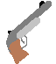
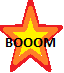

# Fighting Squares #

You want to play a quick offline game with your 7 friends on the same PC but cannot find anything decent?
*Fighting Squares* might be exactely what you were looking for. (However, please read the short paragraph about Caveats).

## Features ##
* As many user controlled players as you can fit fingers on your keyboard
* One player can simultanously control multiple fighters
* As many bots as your CPU can calculate
* Manage teams however you like (mix bots and players in arbitrary quantity)
* Different game modes including "Free Roam", "Team Deathmatch" and "Money Maker"
* Many different pickups to change your fighting style
* *WeaponCeption* : stack pickups to generate even stronger weapons
* Completely free

## How to Play ##
After starting either the windows executable (needs .NET framework 4.5.2 or higher) or compiling the program yourself, a small window will pop up. This is the start screen where you can either directly go to a quick match or customize the game to your own liking. Simply select your preferred game style by choosing from the combo boxes and then press start. Each player controls one square (starting in one corner of the map). The squares automatically aim at nearby enemy-squares and shoot them with their current weapon. The predefined controls for up to four players are:

| Player | Move Up  | Move Down  | Move Left  | Move Right  |
|:------:|:--------:|:----------:|:----------:|:-----------:|
| **1**  |    W     |    S       |   A        |    D        |
| **2**  | Arrow Up | Arrow Down | Arrow Left | Arrow Right |
| **3**  |   Z      |    H       |   G        |   J         |
| **4**  | Num 5    |    Num 2   |   Num 1    |  Num 3      |

If the game cannot be tailored to your needs with the combo boxes (e.g. more than 4 players or coop mode with all players in one team), you can create your own game by clicking the "customize" button. A new window will open and allow you to add as many teams as you like as well as players and bots for each team including the key-bindings for each player. The start button on the bottom right will start this type of game.

*Pro tip* for customized games: Make sure each player has a seperate letter by clicking on the letter in the player box. You might also select different colors for each team or else it will be hard to find yourself and your enemies.

## Game Modes ##
Currently there are 3 game modes. In all modes computer controlled bots are present which vanish after losing all their health. Their current health can be read from the squares: The more health they lose, the more of the square will turn black. New bots will spawn with time such that there are always fighters on the screen. Player controlled characters are different. They can also be shot, however, after losing their life (fully black square) they turn into ghosts for a certain time until they respawn as squares. Ghosts cannot shoot but can still be controlled and collect pickups.  

### Free Roam ###
No real goal, just run around and shoot each other. Nice to simply watch when no players are enabled, see the group dynamics and see if one team gains control over the whole game area.

### Team Deathmatch ###
Each team tries to shoot as many fighters of any other team as possible. A value is set for when the game is over.

### Money Maker ###
Coins appear on the screen (see *Pickups* section for an image). The team that first gathered the given number of coins wins. Shooting opponent team members has no influence on the score but might help you get the next coin before the enemy does.

## Pickups ##
There is a wide variety of pickups with different effects on your square. Some of them can be stacked. This means that if you have picked up a stackable pickup and collect another pickup that can be stacked on it, there is a finite probability that the old weapon will gain the strength of the new pickup and become more powerful. As an example: After picking up a Cannon your weapon will be shooting big black spheres. If you now collect a Twister pickup, the bullets from your weapon will be modified so that they are still cannonballs but shoot twisting purple shells around them. Which pickups can be stacked with which other pickups is left as an exercise for the user.  :wink:

| Pickup Image                                                                            | Name            |   Effect                                                                     | Can be stacked  |
|:---------------------------------------------------------------------------------------:|:---------------:|:-----------------------------------------------------------------------------|:---------------:|
|          | Coin            | Adds money in Money Maker mode.                                               |     No          |
|         | Health          | Adds health to your player         |     No          |
|        | Shield          | Obtain a shield that protects you for a certain time         | *Only with other shields*       |
|       | Tentacles       | Grow 4 tentacles attacking nearby enemies         |     No          |
|          | Wings           | Flapping wings of golden bullets          |     No          |
|   | Flames          | Shoot a cone of fire         |     No          |
|        | Twister         | Become a whirlwind of destruction        |     *Only with other Twisters*          |
|     | Pistol          | Standard weapon of bots         |     **Yes**          |
|        | Cannon          | Shoot big cannonballs         |     **Yes**          |
| | RocketLauncher  | Shoot small projectiles that explode in the end         |     **Yes**          |

## Terms of Use ##
* Download either the source or the windows executable (needs .NET framework 4.5.2 installed)
* Have fun!
* Feel free to add new game modes, pickups, characters or customize the game however you like
* I would be happy if you shared your new code implementations by issuing a pull request - however please do not commit compiled executables
* When redistributing, please adhere to the license (BSD 3-Clause License)

## Caveats ##
The game was initially designed to test the power of my new computer and can therefore be quite demanding on older hardware.
Depending on the settings you use (spawn rates, amount of bots, players and pickups), it is possible that you run in the limit of your PC's capability resulting in visible lag and slowdown.
If this is the case, try cancelling the game with the escape key ("ESC"). All running game-tasks should subsequently be stopped and CPU usage should decrease. I advise to start with a low number of bots and slow respawn rates and work your way up when your computer can handle it.

## But WHY? ##
This is a legitimate question. There are so many great game engines out there that allow you to create amazing games and I encourage any ongoing game-developer to have a look at them. However it can also be quite interesting to write your own small game engine and implement a Game-Loop, Render-Loop and e.g. a double image buffer on your own. Especially if you are a beginner, this is a good way to learn what is really going on inside a game engine.

I am teaching a C# course at university and my students learn C# from the basics up to windows forms as a nice framework to quickly get (ok-looking) windows. As final projects many of them try implementing a small game as these are the most motivating projects. Very often troubles with framerates and image jitter or step edges appear. Moreover, I often get asked on what can be achieved with this approach. Therefore I started building this game which can essentially play itself (Free Roam and only bots) to see how much I can demand from my computer. As I wanted the program to be comparable to the projects of my students, I sticked to Windows Forms and also implemented some UserControls to show where they can be used. As another side goal, the code is meant as a rough guideline in structuring a project.

After I got the first squares fighting each other, I thought it might be nice to continue and add some pickups, then the idea of different game modes appeared and I ended up with the current version of the game.